# golang从简单的即时聊天来看架构演变(simple-chatroom)
## 前言
俗话说的好，架构从来都不是一蹴而就的，没有什么架构一开始设计就是最终版本，其中需要经过很多步骤的变化，今天我们就从一个最简单的例子来看看，究竟架构这个东西是怎么变的。  
我将从一个最简单的聊天室的功能来实现，看看这样一个说起来好像很简单但的功能，我们需要考虑哪些问题。  

我使用golang实现，从0开始实现，需要借助的是websocket来实现即时，基础知识自己补一下，这里不做过多赘述。  

## 功能描述
即时聊天室包含功能（这里写出的功能假设就是产品经理告诉我们的）：  
1、所用用户能连接聊天室  
2、连接成功的用户能向聊天室发送消息  
3、所有成功连接的用户能收到聊天室的消息  

为了简化，我们暂定只有一个房间，因为即使要求需要多个房间和一个房间差不多；然后我们简化消息存储，我们默认也不持久化消息，因为消息的持久化就会涉及各种数据库操作还有分页查询，这里暂时不做考虑。  

那么你一定奇怪了，这些都没了，那整个实现还有啥难度？你大可以自己先想一想如果是你，你会怎么样去实现。  

**下文中我会用C代表客户端，S代表服务端**  
（本文为了展示架构的演变，如果你能想到更好的架构或者一开始就直接想到最终版本，那么证明你已经有很多的经验积累了，给大佬递茶）  

## 版本1
第一个版本肯定是最简单的版本，我们就笔直朝着目标走。  
我们知道websocket能实现最基本的通信。  
客户端发送消息，服务端接收消息，C -> S  
服务端发送消息，客户端接收消息，S -> C  

那么聊天室就是：很多C发消息给S  
S将所有收到的消息发给**每一个**C  
那么我们的第一个架构就很容易想到是这样子的：  

我们在服务端维护一个连接池，连接池中保存了连接的用户，每当服务端收到一个消息之后，就遍历一遍连接池，将这个消息发送给所有连接池中的人。流程图如下：  
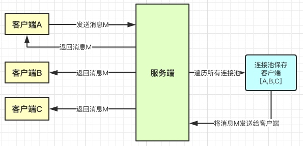  

那么下面，我们用代码来实现一下  
首先定义Room里面有一个连接池  
  

然后我们写一个处理websocket的方法  
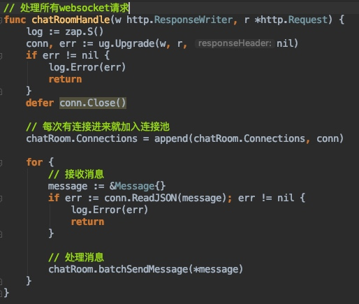  

最后写一个群发消息，遍历连接池，发送消息  
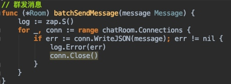  

补全其他部分，就完成了，这就是我们第一个版本，然后我们用一个测试的html测试一下    
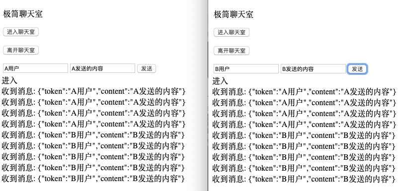  
嗯，完成啦~我真棒，真简单  

当然不可能那么简单！！！还有很多问题！ 
针对于第一个版本，那么存在的问题还有  
1、我们发现，当用户断开连接的时候，连接池里面这个连接没有被移除，所以消息发送的时候会报错，而且连接池会一直变大。  
2、用户很多，遍历发送消息是一个耗时的操作，不应该被阻塞  

针对这两个问题改动如下：  
1、当发送消息失败，证明连接已经断开，所以从连接池中移除连接  
2、群发消息改为gorutinue  

## 版本1.1
所以V1.1修改如下  
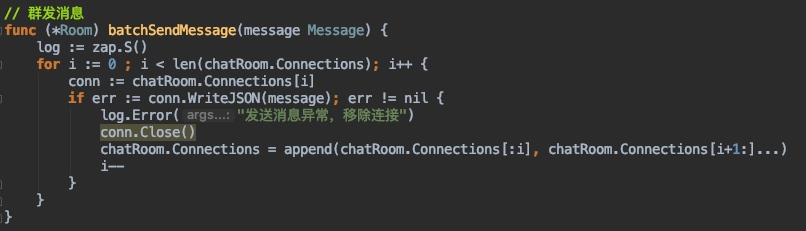  

  

到此为止，第一个版本就到这里了，因为聪明的你应该已经发现这样设计的架构存在一个巨大的问题...  

## 版本2
如果你有一定的并发编程的经验就会发现，上面版本有一个很危险的并发操作，那就是连接池。  

- 连接池的并发操作：  
新的用户进来需要添加入连接池  
如果用户断开连接需要移出连接池  
每次发送消息需要遍历连接池  

我们假设一种情况，当一个协程正在遍历连接池发送消息的时候，另外一个协程把其中一些连接删除了，还有一个协程把新的连接加进去了，这样的操作就是传说中的并发问题。  

而且对于websocket来说还有一个问题，就是如果并发去对同一个连接发送消息的话就会出现panic: concurrent write to websocket connection这样的异常，因为是panic所以问题就非常大了。  

并发问题怎么解决？很多人会说，简单，加锁就完事了  
  
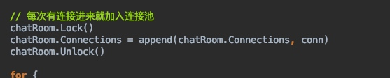  
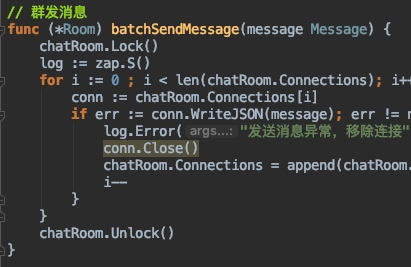  
加完了，搞定，这下没问题了吧。这就是版本2。因为加入了锁机制，所以并发安全保证了，但是
新的问题又出现了，我们如果我们在发送消息的方法中加入延时，模拟出发送消息网络不正常的情况  
time.Sleep(time.Second * 2)  
那么你就会发现，当新的用户加入的时候，因为当前还有消息正在发送，所以导致新加入的用户没有办法获取到锁，也就无法发送消息  
那怎么办呢？  

然后顺便说一下，因为锁的是room在一定并发的程度上还是有可能出现异常  
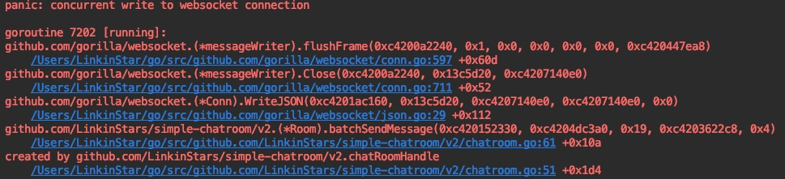  

## 版本3
我在开发golang的时候有这样一个信念，有锁的地方一定能用channel优化，从而面向并发编程，虽然并非绝对，但是golang提供的channel很多情况下都能将锁给替换掉，从而换取出性能的提升，具体怎么做呢？
首先我们想一下有哪些地方可以利用channel进行解耦  
1、第一次连接，我们将连接扔进一个信道中去  
2、断开连接，我们将要删除的连接扔进一个信道中去  
3、发送消息，我们每个连接对象都有一个信道，只需要将消息写入这个信道就能发送消息  

所以我们重新调整一下架构，图如下：  
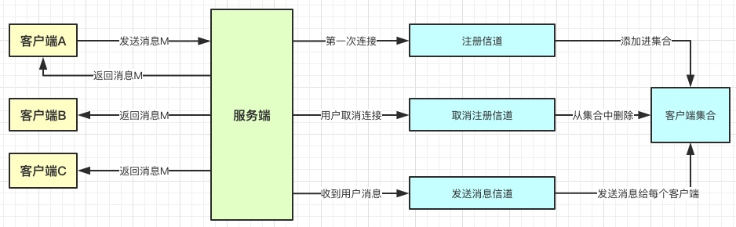  

然后我们看看代码上面如何实现：  

首先定义一个客户端  
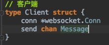  
包含一个连接和一个发送消息的专用信道  
然后定义客户端的两个方法  
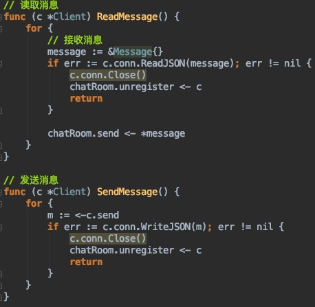

当从websocket中获取到信息的时候，将消息丢到chatRoom的总发送信道中去，由chatRoom去群发。  
当自己的send信道中有消息时，将消息通过websocket发送给客户端。  
同时当发送或者接收消息出现异常，将自己发送给取消注册的信道，由chatRoom去移除注册信息。  

然后定义聊天室  
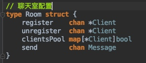  
register用于处理注册  
unregister用于处理移除注册  
clientsPool这里更换为map，方便移除  
send是总发送消息信道，用于群发消息  

然后定义处理websocket方法  
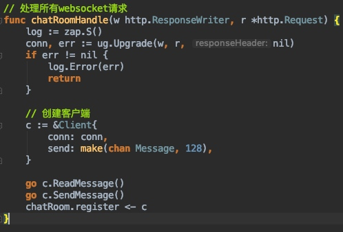  
当前第一次来的时候就创建客户端，然后启动客户端的读取和发送方法，并且将自己发给注册信道  

最后最重要的就是如何去调度处理chatRoom中所有的管道，我们使用select  
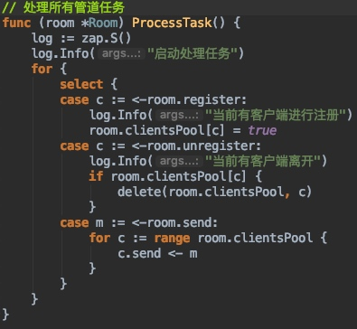  

当有注册的时候就注册，当有离开的时候就删除，当需要发送消息的时候，消息会发送给每一个client各自的send信道由它们自己发送。  
这样就成功实现了使用channel代替了原来的锁  
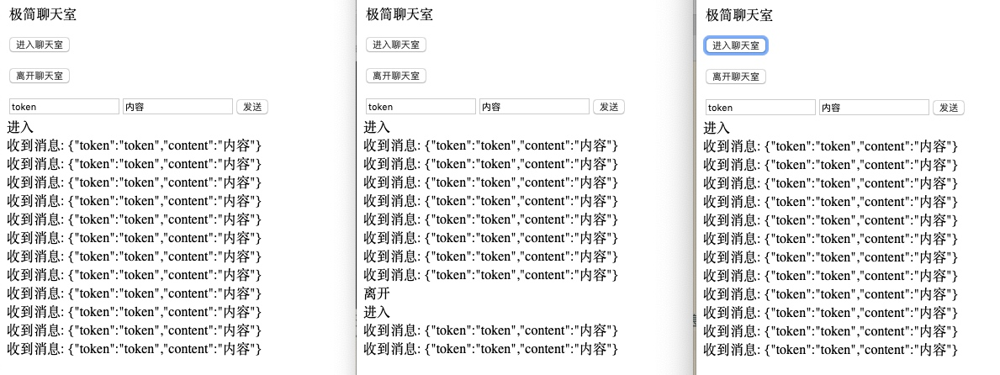  
当前群发消息和客户的加入退出就基本不受到影响了，随时可以加入和退出，一旦加入就会收到消息。  
一切看似很完美吧，其实还有些bug，我们创建一些客户端进行压测试试看。  

## 版本3.1
编写压测代码如下，因为压测就是创建很多客户端发送消息，这里就不多做赘述了  
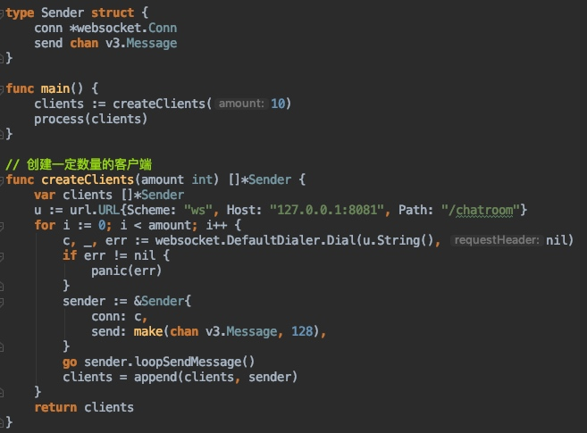  
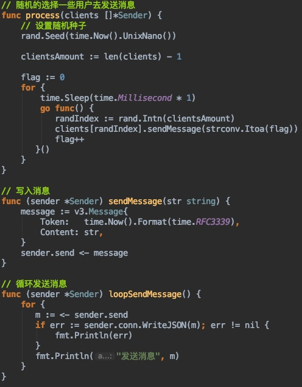  

然后会发现，测试的过程中，如果你启动一个网页版本的客户端发现，你的消息发不出去了。这是为什么呢？
原来我们之前在处理所有管道中任务的时候当处理发送消息的时候有问题，虽然send是一个有缓冲的通道，但是当缓冲满的时候，那么就会阻塞，无法向里面再发送消息，需要等待send里面的消息被消费，但是如果send里面的消息要被消费，前提就是要轮到这个消息被发送，于是造成了循环等待，一定意义上的死锁。（有点绕，你需要理一理）  
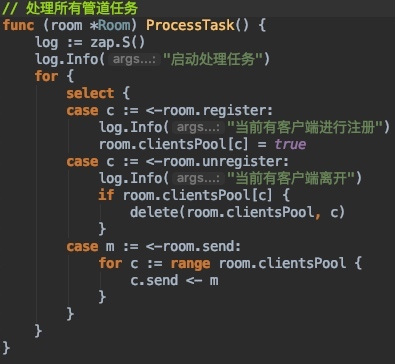  
所以我们需要修改一下代码，修复这个bug，当消息无法写入send信道的时候，那就直接将这个消息抛弃（虽然这样处理好像不太科学），因为要不就是这个用户已经断开连接，要不就是这个用户的缓冲信道已经占满了。如下：  
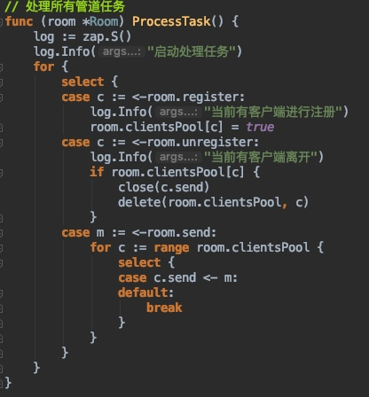  

## 版本3.2
其实在做的过程中就发现了一些问题，一个问题同一个用户如果不停的发送消息，那么一方面是会对服务器造成压力，另一方面对于别的用户来说这是一种骚扰，所以我们需要限制用户发送消息的频率。这里为了测试方便，针对于同一个用户1秒内只能发送一条消息，这样从一定程度上也减少了并发问题的出现。  

改动非常简单，如下：  
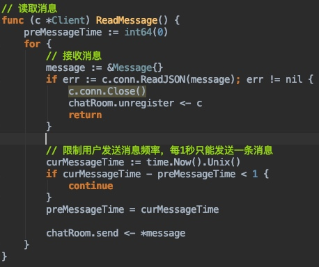  

我们启动多个客户端定时的发送一些消息进行测试，5个客户端下每1ms发送一条消息，本机测试下来没有问题。  

## 后续版本
那么到现在我们已经实际了聊天室的基本功能，对于一个最简单的聊天来说已经足够了，但是因为我们简化了很多细节，所以存在很多优化的地方，下面列举几个地方可以做后续的优化和升级。  

1、消息持久化，当前消息发送之后如果当时用户不在线就无法收到，这样对于用户来说其实是很难受的，所以消息需要进行持久化，而持久化就会有很多方案，保存消息的方式，以及保存消息的时间，不能因为保存消息而影响即时性。以及用户再次登录之后需要将之后保存的消息返回给用户。  

2、消息id，我们现在发送消息的时候是不带消息id的，但是其实作为消息本身，消息的发送需要保证幂等性，相同的消息（消息id相同）不应该发送多次，所以消息id的生成，如何保证消息不重复也是需要考虑的。

3、消息不丢失，消息持久化，网络异常都有可能导致消息丢失，如何保证消息不丢失呢？

4、密集型消息分发，当用户人数很多，当前会创建很多的协程去分发消息，人一多肯定就不行了，而且人一多，一台机器肯定不够，那么分布式维护连接池等等架构的调整就需要进行了。

5、心跳保活，连接一段时间之后，由于网络的原因或者别的原因，可能会导致连接中断的情况出现，所以经过一段时间就需要发送一些消息保持连接。类似PING\PONG

6、鉴权，这个简单，当前任何用户连上就能发送消息，理论上来说，其实需要经过鉴权之后才能发送消息。

7、消息加密，现在消息都是明文传输的，这样传递消息其实是不安全的，所以加密传输消息也是后期可以考虑的，同时消息的压缩也是。

这些后续的扩展就要你来思考一下了，如何去实现。设计的时候你也可以参考很多现实中已经存在的一些例子来帮助你思考。在我们实现的时候也没有借助任何的中间件，所以你可以后期考虑使用一些中间件来完成分布式等要求，如mq等。

是不是看到这里发现只是简单的一个即时聊天后面的架构扩展都是非常可怕的，如果真的要做到像微信或者qq那样随意的单聊和群聊，并且解决各种并发问题还有很多路要走。  

## 总结
这里其实想说明的并不是如何去设计一个IM，想要真正说明的是一个架构师如何进行演变的，其中需要考虑到哪些问题，这些问题又是如何被解决的。其中需要经历不断的测试，调整，测试，调整。还想说明的是，架构没有好和坏，只有适合与否，对于一个小的项目来说就没有必要用大架构，合适的才是最好的。

最后，也肯定有人想了解一些大型的聊天im的架构，这里有几篇博客我认为写的很不错，可以参考一下。  

下面这两篇是对一些大型架构的说明  
https://alexstocks.github.io/html/pubsub.html  
https://alexstocks.github.io/html/im.html  

下面是一些github上的项目  
https://github.com/alberliu/goim  
这个项目比较简单，容易理解，文档介绍详细解释了很多概念，具体使用nsq来实现消息的转发  

https://github.com/Terry-Mao/goim  
这个项目相对复杂  

